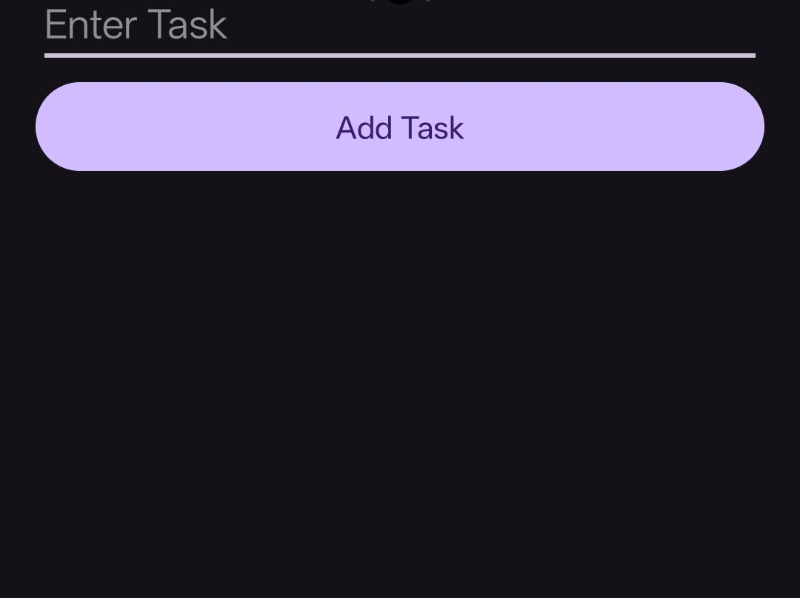

# 📝 To-Do List App

A simple Android To-Do List application developed using Java and Android Studio.

## 🚀 Features

- Add New Tasks
- Edit Existing Tasks
- Delete Tasks
- User-Friendly Interface
- Real-Time Task Management

## 🛠️ Technologies Used

- Java
- Android Studio
- XML
- RecyclerView

## 📸 Screenshots

### User Interface

### Add Task

### Edit Task

### Delete Task

### Task List

## 🎯 Learning Outcomes

- Android UI Design
- RecyclerView Implementation
- Event Handling
- CRUD Operations (Create, Read, Update, Delete)
- User Input Management
- Android App Development Fundamentals

## 📂 Project Structure

- MainActivity.java
- TaskAdapter.java
- activity_main.xml
- item_task.xml

## 👨‍💻 Author

Daksh Gajjar

## 🔗 Internship

Task-02 completed as part of the Android Development Internship at Prodigy InfoTech.
